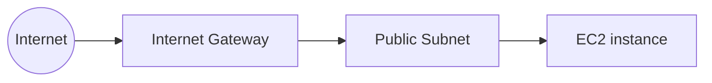

# Terraform AWS Networking Lab

This lab describes a small AWS network and EC2 workload as code. Its goal is to demonstrate repeatable provisioning, basic network routing, least-access security defaults, standardized tags, and an explicit cost lifecycle with `terraform destroy`.

## Architecture



Terraform creates:

- one VPC with DNS support;
- one public subnet in the first available Availability Zone;
- one Internet Gateway attached to the VPC;
- one route table with `0.0.0.0/0` routed to the Internet Gateway and an explicit subnet association;
- one Security Group with outbound IPv4 access and no inbound access by default;
- one small Amazon Linux 2023 EC2 instance with an encrypted 8 GiB `gp3` root volume, IMDSv2 required, and a public IPv4 address.

All taggable resources inherit `Project`, `Environment`, and `ManagedBy = Terraform`. Each main resource also receives a descriptive `Name` tag.

## Networking concepts

- **VPC:** an isolated virtual network with its own private IP address range.
- **Subnet:** a slice of the VPC CIDR placed in one Availability Zone. This subnet is public because its route table sends internet-bound IPv4 traffic to an Internet Gateway.
- **Route table:** decides where network traffic is sent. The local VPC route is implicit; this lab adds `0.0.0.0/0` through the Internet Gateway.
- **Internet Gateway:** connects the VPC routing domain to the public internet. For IPv4 communication, the instance also needs a public IPv4 address.
- **Security Group:** a stateful firewall attached to the EC2 instance. The default configuration allows no inbound sessions. Optional SSH requires both an existing key pair and an explicit trusted CIDR.

## Prerequisites

- Terraform `>= 1.5` and `< 2.0`;
- an AWS account and AWS CLI credentials configured locally through a profile, environment variables, or an IAM role;
- permissions to read AMIs and Availability Zones and to manage VPC, EC2, route, subnet, Internet Gateway, Security Group, and tag resources;
- an AWS Region where the selected `t3.micro` or `t2.micro` instance type is available.

Verify your identity before creating a plan:

```bash
aws sts get-caller-identity
```

Never place access keys in `.tf` or `.tfvars` files.

## Configuration

Copy the example and edit the resulting local file:

```bash
cp terraform.tfvars.example terraform.tfvars
```

| Variable | Default | Purpose |
|---|---:|---|
| `aws_region` | `us-east-1` | Region for all resources |
| `project_name` | `terraform-aws-networking-lab` | Naming prefix and `Project` tag |
| `environment` | `lab` | Cost/lifecycle tag; accepts `lab`, `dev`, or `test` |
| `vpc_cidr` | `10.0.0.0/16` | Private VPC range |
| `public_subnet_cidr` | `10.0.1.0/24` | Public subnet range inside the VPC |
| `instance_type` | `t3.micro` | Cost-limited EC2 size; accepts `t2.micro` or `t3.micro` |
| `ssh_allowed_cidr` | `null` | Optional trusted IPv4 CIDR for port 22 |
| `key_name` | `null` | Optional existing EC2 key pair, required with SSH |

For SSH, set both optional values and use your current public IPv4 with `/32`. Do not use `0.0.0.0/0` for SSH.

## Validate locally

Formatting does not contact AWS:

```bash
terraform fmt -check -recursive
```

Validation requires the AWS provider to be downloaded, but does not provision resources:

```bash
terraform init -backend=false
terraform validate
```

After the first successful `terraform init`, commit the generated `.terraform.lock.hcl` so future runs use the selected provider version consistently. Do not commit `.terraform/`, state, real `.tfvars`, or saved plan files.

## Plan, apply, and destroy

Initialize and review the proposed changes:

```bash
terraform init
terraform plan -out=lab.tfplan
terraform show lab.tfplan
```

Only after reviewing the plan and confirming the account, Region, instance type, and tags:

```bash
terraform apply lab.tfplan
```

This repository does not run `terraform apply` automatically. Applying is an explicit operator decision.

When the experiment is finished, always remove the lab:

```bash
terraform plan -destroy
terraform destroy
```

Run `terraform show` or check the AWS console afterward if cleanup reports an error. Do not delete the state file before Terraform destroys the managed resources.

## Costs, security, and limitations

- The EC2 instance, its EBS root volume, public IPv4 address, and data transfer can generate charges. Free Tier eligibility varies by account and current AWS terms.
- The VPC, subnet, route table, Security Group, and Internet Gateway do not by themselves provide an application or high availability.
- There is no NAT Gateway, Load Balancer, RDS database, Elastic IP, private subnet, IPv6, or multi-AZ design in this first version.
- Public IPv4 does not mean inbound traffic is open: the Security Group denies inbound access unless optional SSH is configured.
- The state uses Terraform's local backend for learning simplicity. Local state must remain unversioned because it can contain infrastructure attributes and sensitive values. A future team-oriented lab should use a protected remote backend with locking.
- The AMI is selected dynamically from Amazon-owned Amazon Linux 2023 images, so a future plan may select a newer image and propose replacing the instance.

The strongest cost control for this temporary lab is simple: review the plan, apply only when actively studying, and always run `terraform destroy` afterward.
